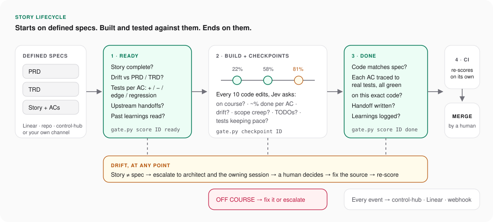
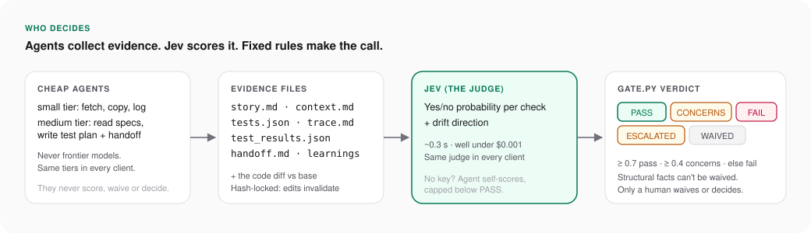
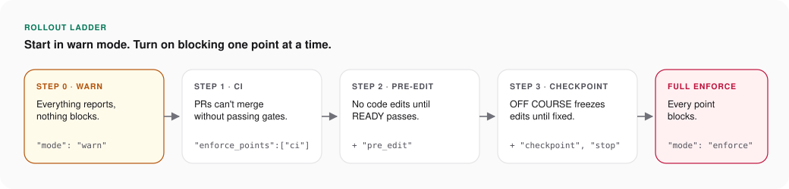

# story-gate

**Every story starts on defined specs, is built and tested against them, and ends on them.**
story-gate checks that this happens in any AI coding client. Cheap agents collect the evidence, an independent judge scores it, and fixed rules decide the verdict.

<p align="center"></p>

---

## A. The problem we're solving

AI coding agents are fast and eager to say "done". Left alone, they:

| What goes wrong | What it costs |
|---|---|
| Start coding from a vague or incomplete story | Rework, and features nobody asked for |
| Drift from the PRD/TRD without telling anyone | Architecture erodes quietly, and docs stop telling the truth |
| Write tests that don't map to the acceptance criteria, or skip negative and edge cases | "Green" builds that don't prove the story works |
| Lose the thread mid-story and wander off scope | Wasted sessions and half-finished work |
| Hand off nothing to the next story or agent | Every dependent story starts by re-discovering context |
| Make the same mistake again next week | No learning across sessions, clients or projects |

Each client (Claude Code, Codex, Cursor, Gemini, Windsurf/Devin, Grok, Muse, Cowork) has different hooks and models, so there has been no single, consistent check across them.

## B. Expected outcome

**A story is only "done" when it is complete, delivered, and provably matches its specs.** In practice:

- **Spec in:** work starts only from a story that is complete, testable and consistent with the PRD/TRD.
- **Built to spec:** mid-story checkpoints catch drift and scope creep while they're still cheap to fix.
- **Tested against spec:** each acceptance criterion maps to planned positive, negative, edge and regression cases. Those map to real automated tests, which must pass on the *exact* code being shipped.
- **Spec out:** the finished code matches the story and TRD. Any deviation was decided by a human and is recorded.
- **Nothing lost:** a handoff tells the next story what changed, and learnings are logged so other agents avoid the same mistakes.
- **No self-grading:** agents can't pass their own work, waive checks, or edit verdicts.

<p align="center"></p>

## C. How to use it in each client

### 1. Install once per repo
```bash
cp -r story-gate/.story-gate <repo>/
cd <repo>
python3 .story-gate/gate.py install      # Windows: python .story-gate\gate.py install --python python
python3 .story-gate/gate.py doctor       # shows which hooks, files and judge are working
```

**What `install` writes.** It only adds to existing files, so it's safe to run again:

| Item | Where |
|---|---|
| Hooks for 6 clients | `.claude/` `.codex/` `.cursor/` `.gemini/` `.devin/` `.grok/` |
| The skill | `.agents/skills/story-gate/` and `.claude/skills/story-gate/` |
| Rules block | `AGENTS.md`, `CLAUDE.md`, `GEMINI.md` |
| CI check | `.github/workflows/story-gate.yml` |

Then:

1. Add the `OPENROUTER_API_KEY` repo secret so CI can re-score every PR independently.
2. Add `story-gate` as a required check in branch protection when you move to enforce.

### 2. Day to day (same commands everywhere)
```bash
gate.py start VIA-12          # make the story folder; the agent fills story.md, context.md, tests.json
gate.py score VIA-12 ready    # READY gate
gate.py checkpoint VIA-12     # any time while building (automatic in hook clients)
gate.py record-tests VIA-12   # runs the pinned test command, records evidence
gate.py score VIA-12 done     # DONE gate, writes trace.md
gate.py status                # one-line summary
```

### 3. What each client does automatically

Judging always runs in `gate.py` and Jev, never in the client's own model. Every client therefore gets the same verdict; only the amount of automation differs.

| Client | Skill found at | Blocks edits before READY | Auto checkpoints | Blocks "done" before DONE | Cheap sub-agents | Setup note |
|---|---|---|---|---|---|---|
| **Claude Code** | `.claude/skills` | Yes | Yes | Yes | Yes: `small`=haiku, `medium`=sonnet | none |
| **Codex CLI** | `.agents/skills` | Yes | Yes | Yes | Yes (agent TOML `model=`) | Trust the project `.codex/` layer |
| **Cursor** | `.agents/skills` | Yes | Yes | Yes | Yes (agent `model:`) | May show warnings twice (it also reads Claude hooks) |
| **Gemini CLI** | `.agents/skills` | Yes | Yes | Yes | Yes (Flash models) | none |
| **Windsurf / Devin** | `.agents/skills` | Yes | Run `checkpoint` manually | Warn only | Pick model in UI | none |
| **Grok Build** | `.claude/skills` | Yes | Run `checkpoint` manually | Yes | Unverified | Run `/hooks-trust` |
| **Muse Code** | `.agents/skills` | Unverified | Run `checkpoint` manually | Unverified | One model family; steps run inline | none |
| **Cowork** | account skill | No (hooks don't fire) | Run `checkpoint` manually | No | Yes | Relies on the skill + CI |

**The CI check is the backstop in every row.** Whatever wrote the code, the PR can't pass the `story-gate` check without the gates.

**Models are tiers, not names.** `config.json` → `models` assigns each step either:
- `small`: the cheapest fast model your client offers, or
- `medium`: its standard coding model.

Frontier models are never used for gate work.

## D. What we evaluate today

**Structural** checks are hard facts read from files and git. They can't be waived. **Jev** checks are a probability from the judge: 0.7 or above passes, 0.4 or above raises concerns, anything lower fails.

### READY: is the story fit to build?
| Check | Type | Question |
|---|---|---|
| `story_present` | Structural | Story copied verbatim from its source, not a skeleton |
| `context_present` | Structural | PRD, TRD, upstream handoffs and prior learnings sections are all filled |
| `test_matrix` | Structural | Every AC has positive, negative, edge **and** regression cases, or a stated reason one doesn't apply |
| `upstream_handoffs` | Structural | Every `depends_on` story has a handoff |
| `dor_value` `dor_scope` `dor_interfaces` `dor_dependencies` `dor_nfr` `dor_small` `dor_no_blockers` | Jev | Definition of Ready: value, scope, interfaces, dependencies, NFRs, small enough, no open blockers |
| `ac_testable` `ac_covers_scope` | Jev | Each AC is pass/fail and together they cover the scope |
| `tests_plan_adequate` | Jev | The planned cases are meaningful, not filler |
| `drift_prd` `drift_trd` + direction | Jev | Consistent with the PRD/TRD? If not, which side should change? |
| `learnings_applied` | Jev | Relevant past learnings were used |

### CHECKPOINT: still on course?
| Signal | Meaning |
|---|---|
| Per-AC progress | Done, partial or todo for each AC. The average gives an **estimated** % complete |
| `on_course` / `no_unplanned_scope` | Heading toward the ACs and the TRD, with no extra features |
| `no_deferrals` / `tests_keeping_pace` | No TODO stubs, and tests are written alongside the code |
| Drift direction | Has the work started to deviate? |

The result is **ON_TRACK**, **AT_RISK** (fix the named cause) or **OFF_COURSE** (stop, correct the work, or escalate).

### DONE: delivered to spec?
| Check | Type | Question |
|---|---|---|
| `ready_gate_passed` | Structural | READY passed, and the story hasn't changed since |
| `tests_ran_green` | Structural | The pinned test command passed on **this exact code** |
| `traceability` | Structural | Every AC lists automated tests (`test_refs`) that exist in the changed code (writes `trace.md`) |
| `handoff_written` | Structural | Handoff has all six sections, including drift decisions |
| `learnings_recorded` | Structural | At least one learnings entry, with root cause and rule for errors |
| `code_changed` | Structural | There is real code in the diff |
| `impl_matches_acs` `impl_no_unplanned_scope` `drift_trd_after` | Jev | The code does what the ACs say, nothing more, and follows the TRD |
| `tests_implemented` `no_deferrals` | Jev | The tests written match the plan, with no deferred work |
| `handoff_out` `learnings_specific` | Jev | The handoff is usable by a stranger, and the learnings are specific |

### Drift: never resolved silently
When the story and spec disagree:
1. The gate raises **ESCALATED** and notifies your sinks (control-hub, Linear, webhook).
2. The architect or orchestrator and the owning session look at what changed and why.
3. A human records the decision:
   ```bash
   gate.py decide <ID> --drift story|spec|none --by <who>
   ```
4. Then fix the source document or the story.

## E. Turning things on and off

<p align="center"></p>

All settings live in `.story-gate/config.json`. CI always reads the copy from the **base branch**, so a PR can't loosen its own rules.

| Setting | Default | Turn it on/up | Turn it off/down | Impact |
|---|---|---|---|---|
| `mode` | `"warn"` | `"enforce"` | `"warn"` | Warn reports everything and blocks nothing. Enforce blocks at every point below |
| `enforce_points` | `[]` | add `"ci"`, `"pre_edit"`, `"checkpoint"`, `"stop"` | remove items | Blocks only at the listed points while still in warn mode. Use this to roll out one step at a time |
| `block_on_concerns` | `false` | `true` | `false` | Decides whether CONCERNS blocks like FAIL or only warns |
| `test_command` | `""` | e.g. `"pytest -q"` | `""` | Pins the real test suite so a fake "green" run can't count. Strongly recommended |
| `checkpoint.every_edits` | `10` | lower = more often | `0` = auto checkpoints off | Controls how often Jev checks course mid-story. Each check takes about 1 s and a fraction of a cent |
| `thresholds.pass` / `.concerns` | `0.7` / `0.4` | raise = stricter | lower = looser | Tune these with pilot data |
| `judge.jev` | `true` | `true` | `false` | Off means agent self-scores only, which can **never** PASS |
| `judge.allow_self_judge_pass` | `false` | `true` (testing only) | `false` | Lets self-scores pass. Never use it in real repos |
| `exempt_globs` | story docs, `docs/**/*.md`, `*.md` | add paths | remove paths | Files that can be edited without a READY gate |
| `sources` / `sinks` | Linear, repo, control-hub, custom | add an entry | remove an entry | Sources: where specs are read from. Sinks: where verdicts, checkpoints, drift alerts and learnings are sent |
| `models` | `small` / `medium` tiers | change a tier | — | Cost versus depth of evidence gathering. Judging is unaffected |

**Recommended rollout:**
1. Run in warn mode across all clients for a few weeks to tune thresholds.
2. Turn on `ci`.
3. Turn on `pre_edit`.
4. Turn on `checkpoint` and `stop`.
5. Switch to full `enforce`.

## Known limits (pilot)

- **Hook working directory:** hooks other than Claude Code's assume the repo root as the working directory.
- **Cowork and Muse:** Cowork ignores hooks, and Muse's hooks are unverified. CI is the backstop for both.
- **Jev's output:** Jev returns scores, not reasons, and the % complete figure is an estimate.
- **Waivers and decisions:** these are recorded with a name but not yet tied to a verified GitHub identity. Hardening this is on the v0.3 list.

## Tests
`python -m unittest tests/test_gate.py` runs on Linux and Windows, with Python 3.9 and 3.12.
