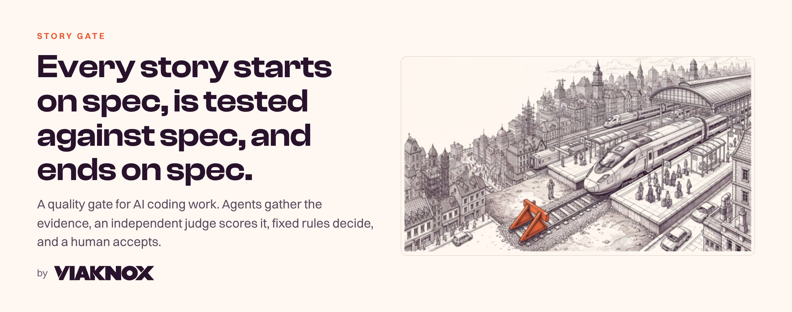
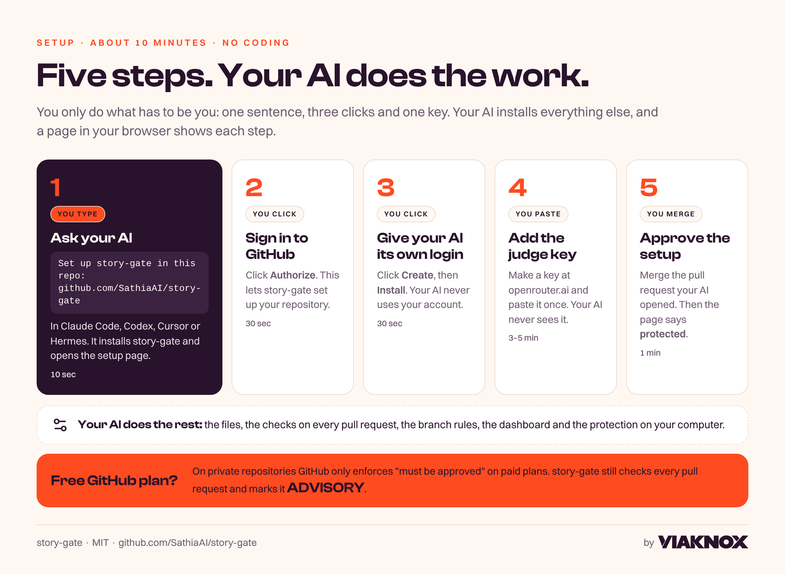
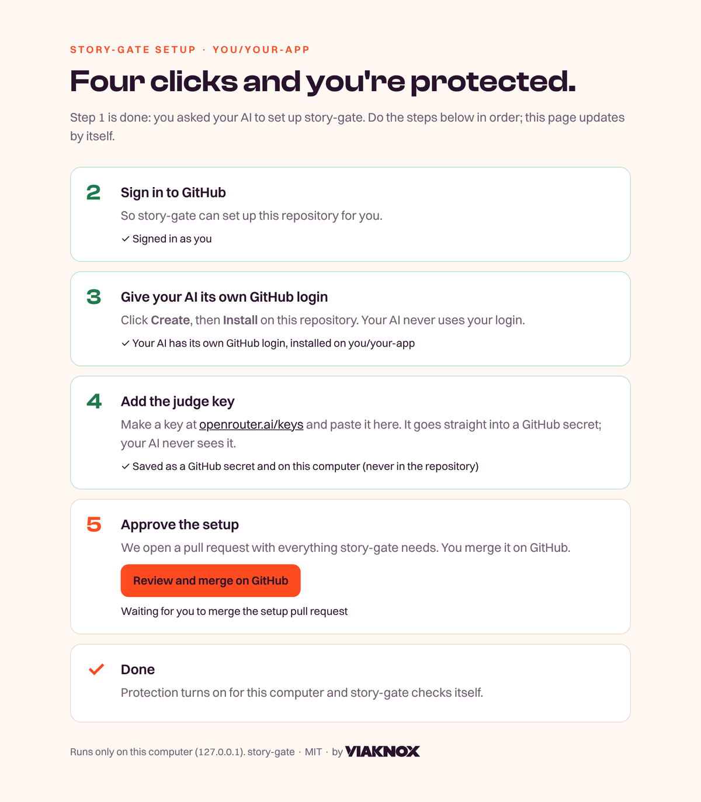
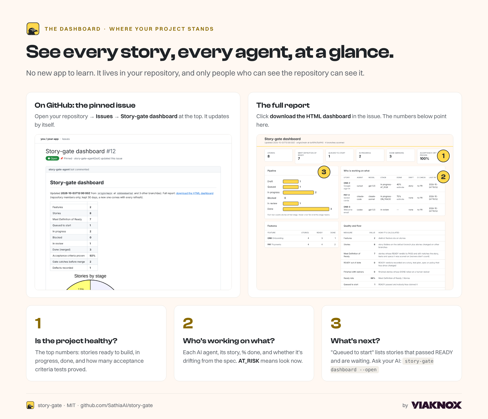
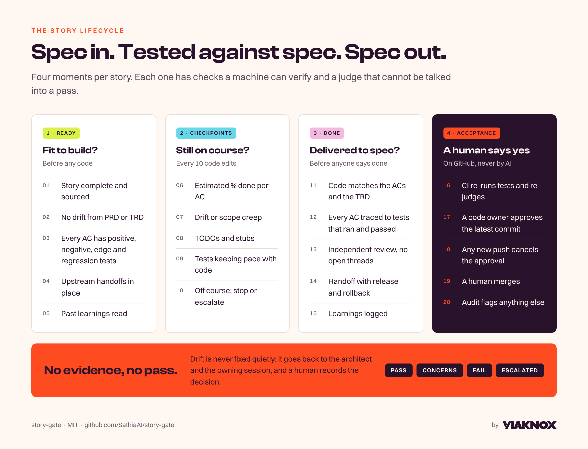

<p align="center"></p>

# story-gate

**Ship production-grade work with AI coding tools, without being a coder.** story-gate makes your AI write down what it will build before it builds it, checks the work against that plan, and won't let anything merge until **you** approve it (on free GitHub plans with private repositories it warns instead; see *Good to know*).

It works in Claude Code, Codex, Cursor, VS Code, Gemini CLI, Hermes, Windsurf and cloud agents. The setup page ticks the ones it finds on your computer; [what each tool gets](docs/client-security.md).

1. Your AI writes the story and its tests first.
2. An independent judge scores the work, for a fraction of a cent.
3. Fixed rules decide whether it's ready.
4. You approve. Where GitHub enforces branch rules, nothing merges without you.

## Set it up in 5 steps

<p align="center"></p>

**Step 1.** Open your project in your AI tool and paste this:

```text
Set up story-gate in this repo: https://github.com/SathiaAI/story-gate
```

**Steps 2 to 5** happen on a page that opens in your browser. It tells you exactly what to click, and ticks each step off when it's done.

<p align="center"></p>

**What you need:** a GitHub account, your project on GitHub, and an AI coding tool. Nothing else; your AI installs the rest.

**The judge key (step 4):** make one at [openrouter.ai/keys](https://openrouter.ai/keys) and add a few dollars of credit. Each check costs a fraction of a cent. The key goes straight into a GitHub secret, and your AI never sees it.

**Who approves:** you, plus anyone you add in step 5 (they need write access to the repository). Any one of you can approve.

**Teammates:** each person pastes the same sentence once on their own computer. Their setup skips steps 4 and 5.

## Use the dashboard

<p align="center"></p>

- **Find it:** open your repository on GitHub → **Issues** → **Story-gate dashboard**, pinned at the top. It updates by itself every 30 minutes.
- **Read it in this order:**
  1. **The top numbers.** How many stories are ready, in progress and done, and how many acceptance criteria are proven by tests.
  2. **Who is working on what.** Each AI agent, its story and % done. `AT_RISK` or a drift note means: look now.
  3. **Queued to start.** Stories that passed READY and are waiting for an agent.
- **The full report:** click **download the HTML dashboard** in the issue. Or ask your AI to run `story-gate dashboard --open`.
- **Private stays private:** the dashboard lives in your repository, so only people who can see the repository can see it.

## How a change flows

<p align="center"></p>

You ask for a feature. Your AI writes the story and the tests, and story-gate checks they're good enough to build from (**READY**). While it builds, story-gate checks it's still on course (**CHECKPOINTS**). When it's finished, the tests must prove every acceptance criterion (**DONE**). Then it opens a pull request, and **you approve and merge**.

## Good to know

- **Free GitHub plan, private repository:** GitHub doesn't enforce "must be approved" there. story-gate still checks every pull request and marks it **ADVISORY**.
- **Your AI never uses your GitHub login.** It works through its own login (step 3), so it can't approve or merge its own work.
- **Branches can't switch story-gate off.** The rules come from your main branch, and the checks run from a verified copy on your computer. See [security](docs/client-security.md).
- **Pilot:** story-gate is pre-1.0. Signed releases are coming; until then, setup installs from a pinned version on GitHub.

## Learn more

- [The full guide](docs/guide.md): every setting, manual setup, lockdown and fallbacks.
- [How each AI tool runs story-gate](docs/client-security.md) · [Pinned project hooks](docs/hook-pinning.md)

<details>
<summary><b>For AI agents: how to run the setup</b></summary>

When the person asks you to set up story-gate:

1. Make sure `uv` is installed (`uv --version`). If it isn't, install it with the official installer:
   - macOS / Linux: `curl -LsSf https://astral.sh/uv/install.sh | sh`
   - Windows (PowerShell): `powershell -ExecutionPolicy ByPass -c "irm https://astral.sh/uv/install.ps1 | iex"`
2. Install story-gate: `uv tool install --python 3.12 git+https://github.com/SathiaAI/story-gate@v0.5.0`, then `uv tool update-shell` if `story-gate` isn't found.
3. In the project folder, run `story-gate init` **in the background**. It prints a local page address and opens it in the browser. Keep it running until it prints `story-gate: story-gate is protecting ...`.
4. Tell the person: "A setup page opened in your browser. Follow it; I'll wait." Do not click, sign in, create apps or type the judge key for them. Those steps are theirs.
5. When it finishes, run `story-gate doctor` and report its summary in plain words.

If the setup page reports an error, read it to the person and follow its instructions. Run `story-gate init` again to continue; it skips what is already done on GitHub.
</details>

<sub>Tests: `python -m unittest tests/test_gate.py tests/test_packaging.py`. CI runs `tests/test_gate.py` on Linux, Windows and macOS; the packaging tests run locally for now. MIT licensed. story-gate by Viaknox.</sub>
