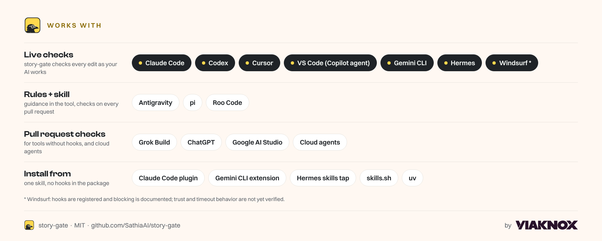
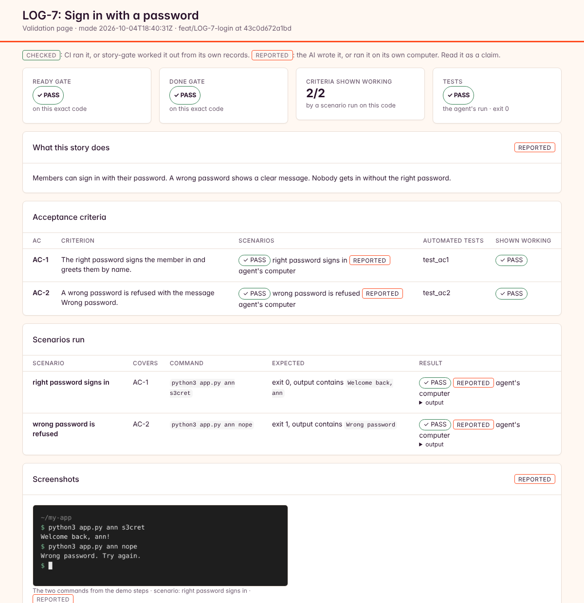

<p align="center"></p>

# story-gate

**Make your AI prove its work before it ships.**

story-gate makes your AI coding tool plan before it builds, check its course while it builds, and show you the feature working when it's done. Then it waits for your OK. Your work is much safer to ship. No coding needed (a little GitHub is).

**Free and open source (MIT) · pilot release (pre-1.0)**

Works in Claude Code, Codex, Cursor, VS Code, Gemini CLI, Hermes, Windsurf and cloud agents. [What each tool gets](docs/client-security.md).

<p align="center"></p>

<p align="center"></p>

## Sound familiar?

- Your AI says "done", but the button does nothing.
- You fix one thing, and two other things break.
- It built something you never asked for.
- You can't tell if the code is any good, so you're afraid to merge.
- The next session forgets everything the last one learned.

story-gate fixes this with four checks on every piece of work (a **story**):

| When | What story-gate checks | What you see |
|---|---|---|
| **Before** any code | The plan is clear and every goal has a test (READY) | A short plain-English summary |
| **While** it builds | It's still on course, with no scope creep (CHECKPOINTS) | % done on the dashboard |
| **When** it says done | The tests pass, and the AI ran the feature for real for every goal (DONE). The pull request check runs the tests and those runs again. A run that can't work there (it needs a device, say) is marked "reported", and the check flags it for you | A one-page validation report |
| **Before** it merges | You approve it on GitHub | Nothing merges without you, where GitHub enforces branch rules |

An independent AI judge scores each check. Your coding AI never grades its own work.

## What you get

<p align="center"></p>

For every story, a **validation page** shows:

- the plan and the goals (**acceptance criteria**),
- each goal next to the run that shows it working,
- screenshots, bugs found and fixed, and lessons learnt,
- steps to try it yourself.

Each fact is marked **checked** (the pull request check ran it) or **reported** (the AI says so). Ask your AI: `story-gate report <story id> --open`.

## Use it when

- you're building something real people will use,
- your AI keeps breaking things that worked,
- more than one person (or AI) works in the same project,
- you moved from a no-code builder to Claude Code, Cursor or Codex, and want a safety net.

**Skip it** for a weekend prototype or a throwaway script. The checks add a few minutes per story.

## See it block a real pull request

In our public [demo repository](https://github.com/SathiaAI/story-gate-demo), an AI opened [this pull request](https://github.com/SathiaAI/story-gate-demo/pull/5) for one small feature: 10% off orders of 10 or more items. Its own unit tests pass, and its write-up says "Done".

story-gate ran every goal again on GitHub. An order of exactly 10 items paid full price (40.00, not 36.00). The check is red and the merge is blocked. Open the **story-gate** check on that pull request to see the evidence.

Then the AI fixed it in [this pull request](https://github.com/SathiaAI/story-gate-demo/pull/6): `qty > 10` became `qty >= 10`, and it added the missing test for exactly 10 items. Every goal passes, the judge agrees, and the check turns green once a person approves.

| | Red: [#5](https://github.com/SathiaAI/story-gate-demo/pull/5) | Green: [#6](https://github.com/SathiaAI/story-gate-demo/pull/6) |
|---|---|---|
| The AI says | "Done" | "Done" |
| Its own unit tests | Pass | Pass |
| story-gate runs "exactly 10 items" | 40.00, expected 36.00 | 36.00 |
| Merge | Blocked | Allowed after a person approves |

## Try it first (one line to install, nothing to set up)

See story-gate catch a real bug before you change anything. Install it with one line:

**Mac or Linux** (Terminal):

```bash
curl -LsSf https://raw.githubusercontent.com/SathiaAI/story-gate/v0.7.0/install.sh -o /tmp/story-gate-install.sh && sh /tmp/story-gate-install.sh
```

**Windows** (PowerShell):

```powershell
powershell -ExecutionPolicy ByPass -c "irm https://raw.githubusercontent.com/SathiaAI/story-gate/v0.7.0/install.ps1 | iex"
```

Then run:

```bash
story-gate try
```

**What the installer does:** it installs [uv](https://docs.astral.sh/uv/) (a Python tool manager) if you don't have it, then story-gate at this exact release, and puts `story-gate` on your PATH. It doesn't change anything else. It's short: read [install.sh](install.sh) or [install.ps1](install.ps1) first if you like. Already have uv? Run `uv tool install --python 3.12 git+https://github.com/SathiaAI/story-gate@v0.7.0` instead.

`story-gate try` makes a throwaway example project in your temp folder with one small story and a real bug. It runs each goal for real, shows one passing and one failing, and opens the validation page. No GitHub, no judge key, no network, and your own projects aren't touched.

## Set it up in 5 steps

<p align="center"></p>

**Step 1.** Open your project in your AI tool and paste this:

```text
Set up story-gate in my project (the folder I have open). Install it from https://github.com/SathiaAI/story-gate, but don't change that repository.
```

Already use skills? `npx skills add SathiaAI/story-gate` adds the story-gate skill to Claude Code, Codex, Cursor and 20+ other AI tools. Then paste the same sentence.

**Steps 2 to 5** happen on a page that opens in your browser. It tells you exactly what to click, and ticks each step off when it's done.

<p align="center"></p>

**From day one,** a pull request that fails story-gate can't be merged (where GitHub enforces branch rules: public repositories and paid plans), as long as your project has tests your AI can name for setup. Your AI's live checks on your computer warn but don't stop it. Without tests, story-gate starts by only warning.

**When it's done,** the page shows an **Open your dashboard** button. Your dashboard is a pinned issue in your repository called **Story-gate dashboard** ([see below](#use-the-dashboard)).

**What you need:** a GitHub account, your project on GitHub, and an AI coding tool. Nothing else; your AI installs the rest.

**The judge key (step 4):** make one at [openrouter.ai/keys](https://openrouter.ai/keys) and add some credit. Each check is one small judge call; OpenRouter shows what each one costs. The key goes straight into a GitHub secret, and your AI never sees it.

**Who approves:** you, plus anyone you add in step 5 (they need write access to the repository). Any one of you can approve. Working alone is fine: the AI opens the pull requests under its own login, so your approval counts.

**Teammates:** each person pastes the same sentence once on their own computer. Their setup skips steps 4 and 5.

## Your first story

1. Ask your AI for one small feature, for example: "Add a contact form with name, email and message."
2. Your AI writes the story: a plain summary, the goals and the tests. story-gate checks it (READY).
3. Your AI builds it. story-gate checks it stays on course.
4. Your AI runs the feature for every goal and writes the validation report (DONE).
5. It opens a pull request. Open the validation page, try the demo steps, then approve on GitHub.
6. Watch it all on your [dashboard](#use-the-dashboard): GitHub → your repository → **Issues** → **Story-gate dashboard**.

**Habits that pay off:**

- **Keep stories small.** One feature a person can see or try. Big stories are hard to check.
- **Read the report before you approve.** If a goal isn't shown working, ask why.
- **Lost track of where a story is?** Ask your AI to run `story-gate next`. It says what's done and what comes next.
- **When a check fails, ask your AI to fix the cause.** Don't ask it to skip the check. It can't approve its own work anyway.
- **Look at the dashboard once a day.** `AT_RISK` means look now.

## Use the dashboard

<p align="center"></p>

- **Find it:** open your repository on GitHub → **Issues** → **Story-gate dashboard**, pinned at the top. It updates by itself every 30 minutes.
- **Read it in this order:**
  1. **The top numbers.** How many stories are ready, in progress and done, and how many acceptance criteria are proven by tests.
  2. **Who is working on what.** Each AI agent, its story and % done. `AT_RISK` or a drift note means: look now.
  3. **Queued to start.** Stories that passed READY and are waiting for an agent.
- **The full report:** click **download the HTML dashboard** in the issue. Or ask your AI to run `story-gate dashboard --open`.
- **Private stays private:** the dashboard lives in your repository, so only people who can see the repository can see it.

## How a change flows

<p align="center"></p>

You ask for a feature. Your AI writes the story and the tests, and story-gate checks they're good enough to build from (**READY**). While it builds, story-gate checks it's still on course (**CHECKPOINTS**). When it's finished, the tests must prove every acceptance criterion, and your AI must run the feature for real and show you the result (**DONE**). Then it opens a pull request, and **you approve and merge**.

## Good to know

- **Your AI never uses your GitHub login.** It works through its own login (step 3), so it can't approve or merge its own work.
- **Branches can't switch story-gate off.** The rules come from your main branch, and the checks run from a verified copy on your computer. See [security](docs/client-security.md).
- **Plain English.** Your AI writes replies, PR descriptions, story summaries and handoffs in short, plain sentences, with diagrams where a picture is clearer. story-gate scores this (an STE-style score, target 80%) and gives advice. See [plain writing](docs/guide.md#plain-writing).
- **Pilot:** story-gate is pre-1.0. Signed releases are coming; until then, setup installs from a pinned version on GitHub.

## How it compares

| | Checks the plan first | Proves each goal works | Re-checks on every pull request | Needs your approval |
|---|---|---|---|---|
| Nothing (just the AI) | No | No | No | No |
| Your tests in CI | No | Only what the tests cover | Yes | No |
| A PR review bot (e.g. CodeRabbit) | No | No | Yes (reads the code) | No |
| **story-gate** | **Yes** | **Yes** | **Yes** | **Yes** |

story-gate works with your tests and your review bot. It runs your tests itself and waits for the review bot's threads to be resolved.

## FAQ

**Do I need to code?** No. You need a GitHub account, and you click Approve and Merge on GitHub. Your AI does the rest.

**What does it cost?** story-gate is free. The judge runs on [OpenRouter](https://openrouter.ai/keys), which charges per call. Each check is one small call, and your OpenRouter activity page shows the exact cost.

**Will it slow my AI down?** A little. Each story takes extra time for the plan, the checks and the report. You get that back in less rework.

**What if the judge is wrong?** Tell story-gate (`story-gate label`). A person can also record a decision or a waiver, but it counts only after a code owner approves.

**Is my code sent anywhere?** Yes, to the judge you chose (OpenRouter by default). For each check it gets that story's evidence: the story and its context, the test plan, the scenarios (what each one runs and expects), `validation.md`, the handoff, the learnings, and the code changes. If you set up a webhook, control-hub or a command to receive events, it gets story-gate's events: verdicts, progress and learnings. Your AI coding tool already sends far more to its own model.

**Can I try it without a judge key?** Yes. Click **Skip for now** at the key step. story-gate then runs in objective mode: it still checks the plan, runs your tests and the story's scenarios in CI, and needs your approval, but nothing checks that the code really does what the story asks. Your tests must write a JUnit XML report (one setting; your AI sets it up) so story-gate sees each test's own result. Every result says **checked without a judge**. To turn the judge on later, do both: add the `OPENROUTER_API_KEY` repository secret, then set `"judge_mode": "full"` in `.story-gate/config.json` in a pull request ([more](docs/guide.md#fallbacks)). A key alone doesn't turn it on.

**I'm on a free GitHub plan with a private repository.** GitHub doesn't enforce "must be approved" there. story-gate still checks every pull request and marks it **ADVISORY**.

<details>
<summary><b>Words used here</b></summary>

| Word | Meaning |
|---|---|
| Story | One piece of work, small enough to build and check in one go |
| Acceptance criteria (goals) | The things that must be true when the story is done |
| Scenario | Your AI running the feature the way a person would, to show a goal working |
| READY, CHECKPOINTS, DONE | The three checks story-gate runs: before, during and after the build |
| Judge | An independent AI that scores the evidence. It is never your coding AI |
| Pull request (PR) | GitHub's page where a change waits for your approval before it joins your project |
| CI | The checks GitHub runs on every pull request |
| Drift | The work, the story and your product documents (PRD, TRD) no longer agree |
| Code owner | A person allowed to approve changes. You, and anyone you add |

</details>

## Learn more

- [The full guide](docs/guide.md): every setting, manual setup, lockdown and fallbacks.
- [How each AI tool runs story-gate](docs/client-security.md) · [Pinned project hooks](docs/hook-pinning.md)

<details>
<summary><b>For AI agents: how to run the setup</b></summary>

When the person asks you to set up story-gate:

1. Make sure `uv` is installed (`uv --version`). If it isn't, install it with the official installer:
   - macOS / Linux: `curl -LsSf https://astral.sh/uv/install.sh | sh`
   - Windows (PowerShell): `powershell -ExecutionPolicy ByPass -c "irm https://astral.sh/uv/install.ps1 | iex"`
2. Install story-gate: `uv tool install --python 3.12 git+https://github.com/SathiaAI/story-gate@v0.7.0`, then `uv tool update-shell` if `story-gate` isn't found.
3. Find how the project's tests run on a clean Linux machine, including installing what they need (for example `npm ci && npm test`). In the project folder, run `story-gate init --test-command "<that command>"` **in the background** (leave the flag out if there are no tests yet). It prints a local page address and opens it in the browser. Keep it running until it prints `story-gate: story-gate is protecting ...`.
4. Tell the person: "A setup page opened in your browser. Follow it; I'll wait." Do not click, sign in, create apps or type the judge key for them. Those steps are theirs.
5. When it finishes, run `story-gate doctor` and report its summary in plain words. Tell the person where their dashboard is (the link `doctor` prints).

If the setup page reports an error, read it to the person and follow its instructions. Run `story-gate init` again to continue; it skips what is already done on GitHub.
</details>

<sub>Tests: `python -m unittest tests/test_gate.py tests/test_packaging.py`. CI runs `tests/test_gate.py` on Linux, Windows and macOS; the packaging tests run locally for now. MIT licensed. story-gate by Viaknox.</sub>
