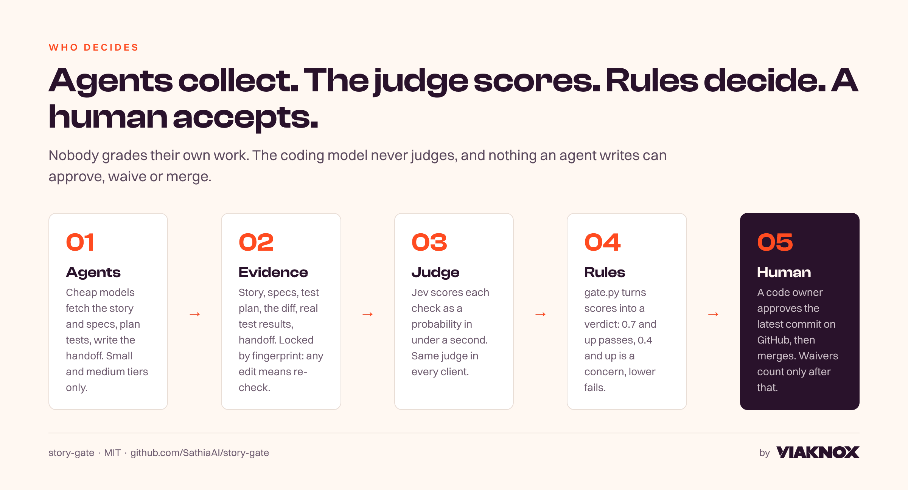
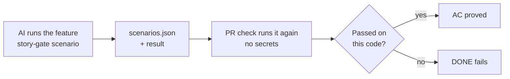
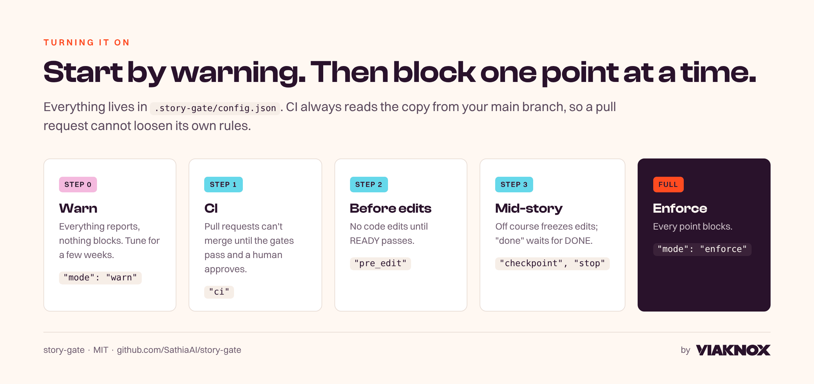
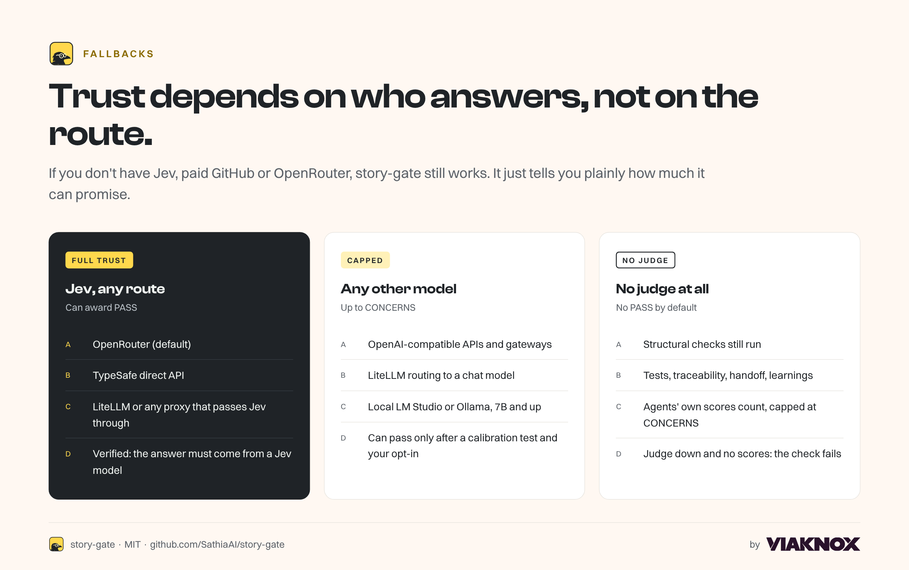

<!-- The full reference. The short version is the README. -->
> **This is the full guide.** Once story-gate is installed on your computer, `gate.py <command>` below means `story-gate <command>`; before that, use `python3 .story-gate/gate.py <command>` (`python .story-gate\gate.py <command>` on Windows).
>
> Most people only need the [README](../README.md): ask your AI to set up story-gate and follow the page. The manual steps below are for people who prefer to run each command themselves.

<p align="center"></p>

**story-gate** is a quality gate for AI coding work that runs the same way in Claude Code, Codex, Cursor, VS Code, Gemini CLI, Hermes, Windsurf/Devin, Grok Build, Muse, Cowork and cloud agents.

1. Cheap agents gather the evidence.
2. An independent judge scores it.
3. Fixed rules decide.
4. A human accepts.

**Contents:** [The problem](#a-the-problem-were-solving) · [Expected outcome](#b-expected-outcome) · [Setup](#setup) · [Using it in each client](#c-using-it-in-each-client) · [What we evaluate](#d-what-we-evaluate-today) · [Settings and their impact](#e-turning-things-on-and-off) · [Dashboard](#f-the-dashboard-how-its-going) · [Fallbacks](#fallbacks) · [Known limits](#known-limits)

---

## A. The problem we're solving

AI coding agents are fast and eager to say "done". Left alone, they:

| What goes wrong | What it costs |
|---|---|
| Start coding from a vague or incomplete story | Rework, and features nobody asked for |
| Drift from the PRD or TRD without telling anyone | Architecture erodes quietly, and the docs stop telling the truth |
| Write tests that don't map to the acceptance criteria | "Green" builds that don't prove the story works |
| Wander off scope mid-story | Wasted sessions and half-finished work |
| Grade their own work, waive their own failures, or act with your GitHub login | Nobody actually checked; "approved" means nothing |
| Hand off nothing, learn nothing | The next story re-discovers the same context and repeats the same mistakes |

Every client has different hooks and models, so until now there has been no single, consistent check across them.

## B. Expected outcome

**A story is done only when it is complete, delivered, provably matches its specs, and a human has accepted it.**

<p align="center"></p>

- **Spec in:** work starts only from a complete, testable story that agrees with the PRD and TRD. The specs are fingerprinted, so a change mid-story is caught.
- **Built to spec:** checkpoints during the work catch drift and scope creep while they're still cheap to fix.
- **Tested against spec:** each acceptance criterion maps to planned positive, negative, edge and regression cases, then to real tests that **CI runs itself**.
- **Spec out:** the code matches the story and TRD. Any deviation was decided by a person and recorded.
- **Accepted by a human:** a code owner approves the latest commit on GitHub, then merges. An AI can't approve, waive or merge its own work.
- **Nothing lost:** a handoff tells the next story what changed and how to roll it back. Learnings are logged so the next agent doesn't repeat the mistake.

<p align="center"></p>

---

## Setup

<p align="center"></p>

**Want to see it first?** Run `story-gate try` (after the install line below). It builds a throwaway example with one story and a real bug, runs each goal, shows one failing and opens the validation page. Nothing to set up.

You do this once per repository. The steps are the same as in the README:

1. **Ask your AI:** `Set up story-gate in my project (the folder I have open). Install it from https://github.com/SathiaAI/story-gate, but don't change that repository.`. It asks before installing, then installs the pinned release (`uv tool install --python 3.12 git+https://github.com/SathiaAI/story-gate@v0.7.0`) and runs `story-gate init`, which opens the setup page.
2. **Sign in to GitHub** on that page (click Authorize).
3. **Give your AI its own login:** click Create, then Install. Your AI never uses your account.
4. **Add the judge key:** paste an OpenRouter key once. It goes into a GitHub secret and your user folder, never the repository.
5. **Approve the setup:** merge the pull request the page opens. The page then says **protected**.

Then check it works: [Prove it works](#prove-it-works) below.

### The same steps by hand (no AI tool)

Use these commands if you'd rather not let an AI run setup, or `story-gate init` can't run where you are. Manual A to D do what steps 1 to 5 do.

**Manual A · Add story-gate to the repository** (steps 1 and 5)
```bash
cp -r story-gate/.story-gate your-repo/      # or download this repo and copy the .story-gate folder
cd your-repo
python3 .story-gate/gate.py install           # Windows: python .story-gate\gate.py install --python python
```
Commit what it adds (the settings, the skill, agent instructions and three workflows: the PR check, the audit and the dashboard) and merge it. Hooks are **not** written into the repository: each person turns them on for their own computer in Manual D (or the setup page does it).

**Manual B · Name the humans** (step 5's branch rules; run it as yourself)
```bash
gh auth login                                 # once, if you haven't
python3 .story-gate/gate.py setup-repo        # add teammates with --owners you,teammate
```
This step:
- Writes `.github/CODEOWNERS` with your username.
- Adds a branch rule that requires a code owner's approval on the latest commit, the `story-gate` check, and resolved review threads.
- Stops GitHub Actions from approving pull requests.

Commit and merge the CODEOWNERS file. If your account can't create rules through the API, import `docs/story-gate-ruleset.json` in **Settings › Rules › Rulesets › New › Import**.

**If GitHub blocks the merge with "rule violation" but every check is green:** GitHub may have switched on **Require an additional approval for unattributed Copilot pull requests** in the ruleset. It asks for a second approval on every pull request the AI opens, which a solo owner can't give. Setup turns it off; to fix an older repository, run `story-gate setup-repo` again, or untick it in **Settings › Rules › Rulesets › story-gate: human acceptance**.

**Manual C · Add the judge key** (step 4)
1. Create a key at openrouter.ai. The default judge is Jev, a scoring model from TypeSafe, used through OpenRouter. OpenRouter charges per check; its activity page shows the exact cost.
2. In your repository, open **Settings › Secrets and variables › Actions › New repository secret**.
3. Name it `OPENROUTER_API_KEY` and paste the key.

For verdicts on your own computer, put the same line (`OPENROUTER_API_KEY=...`) in `judge.env` in your story-gate user folder (`~/.config/story-gate`, or `%APPDATA%\story-gate` on Windows). Keys are never read from a repository.

Using a different judge? See [Fallbacks](#fallbacks).

**Manual D · Set up your computer for AI tools** (steps 2 and 3; only if AI tools run on your computer)
```bash
story-gate install --user                     # once per computer, from the installed (signed) story-gate; checks the signature first
python3 .story-gate/gate.py setup-agent       # opens GitHub: click Create, then Install on your repos
python3 .story-gate/gate.py agent-env --repo you/your-repo   # paste the output into the AI tool's terminal
```
- `install --user` also adds a **`story-gate` command** (in the runtime's `bin` folder; add that folder to your PATH to type it). It runs the verified copy, so AI tools use `story-gate start`, `story-gate score` and so on instead of the repository's `gate.py`. If it isn't on PATH, story-gate's messages print the full command.
- At the start of each AI session in an enrolled repository, story-gate tells the agent how to work with it, from the verified copy (Claude Code, Codex, Cursor, Gemini) and asks it to follow them over repository files. It's guidance, not a lock: the hooks and CI do the enforcing. Codex asks you to trust the new hook once (`/hooks`).
- `story-gate doctor` warns when the rules on your default branch got **weaker** since this computer last accepted them (enforce to warn, lower thresholds, newly allowed project hooks, more exempt files...). If it was intended, run `story-gate enroll` to accept. A pull request that loosens the rules gets the same plain-English list in its story-gate check. The same warning appears to you when an AI session starts (Claude Code, Codex, Gemini; in Cursor the agent is asked to pass it on).
- **Signed releases:** from v0.7.0, every release is signed, and `install --user` prints "Signature: valid" before it installs anything. Run it with the `story-gate` command from the one-line installer (or `uv tool install`): that copy carries the signature. The repository's own `.story-gate/gate.py` and a development checkout have none, so they stop with "NOT installed: no signed release"; `--unsigned` installs them anyway, and doctor reports the copy as unsigned.
- `install --user` copies a signed, fingerprint-checked story-gate into your user folder, turns on the hooks in each tool's **user** settings, and enrolls this repository. It prints every change first with `--dry-run`, keeps backups, and `uninstall --user` undoes it. Codex asks you to trust the new hooks once (`/hooks`).
- It prints the release key fingerprint. It must match **`SHA256:YN6hCUUHe1XHbhYDj1VdYwoeVoIWDDlFJ6yEXDAcR+4`** (also on the release page).
- It also turns on the **checkout filter** in this repository (and in each repository you `enroll`, nowhere else): when git writes an AI tool's hook file, you get the version your default branch approved, minus any command it didn't. Settings live in the repository's own `.git` folder, never in a commit.
- In each other repository that uses story-gate, run `story-gate enroll`. Rules must come from a remote's branch (`origin/main` by default). For a repository with no remote, `enroll --allow-local-policy` works but is weaker (anything on this computer can move a local branch), and doctor says so.
- **Recommended, optional, OFF unless you say yes:** `story-gate lockdown` explains Claude Code's own hard switch for repository hooks before anything changes. See [Lockdown](#lockdown-optional-off-by-default).
- Your AI then pushes and opens PRs as **story-gate-agent[bot]**, never as you.

Cloud agents need no setup here, because they already have their own GitHub identity: Codex cloud, Cursor Cloud and Copilot.

### Prove it works
1. Ask your AI to open a small test PR. The `story-gate` check should stay red until **you** approve the latest commit.
2. Run `story-gate doctor --repo you/your-repo --strict`. It must finish without failures.
3. Run `story-gate hook-selftest`. In enforce mode every tool should say **blocks**.
4. Run `story-gate doctor --prove`. It plants a harmless canary hook on a throwaway commit, checks it out in a throwaway folder, and shows the canary never reaches disk. Your branches and files don't change.

> **Free GitHub plan?** GitHub only enforces branch rules on **private** repositories on paid plans (Pro, Team, Enterprise). story-gate still runs everywhere, but on a free private repository every check says **ADVISORY – NOT ENFORCED**. An audit job opens an issue if anything is merged without your approval.

---

## C. Using it in each client

**Judging never happens in the client's model.** `gate.py` and the judge do the scoring, so every client gets the same verdict. What differs is how much happens automatically. **In every row, the CI check is the backstop.**

| Client | How it learns the rules | Blocks edits before READY | Automatic checkpoints | Blocks "done" before DONE | Cheap sub-agents |
|---|---|---|---|---|---|
| **Claude Code** | `.claude/skills`, CLAUDE.md | Yes, including shell writes | Yes | Yes | Yes: `small`=haiku, `medium`=sonnet |
| **Codex CLI** | `.agents/skills`, AGENTS.md | Yes (trust the story-gate hooks once in `/hooks`) | Yes | Yes | Yes, per-agent `model` |
| **Cursor** | `.agents/skills`, rules | Yes, including shell commands | Yes | Yes | Yes, per-agent `model` |
| **Gemini CLI** | `.agents/skills`, GEMINI.md | Yes, including shell commands | Yes | Yes | Yes (Flash models) |
| **Windsurf / Devin** | `.agents/skills` | Yes (user-level hooks; timeout and trust behaviour unverified) | Run `checkpoint` | Yes | Pick the model in the UI |
| **Grok Build** | `.claude/skills`, AGENTS.md | Reduced protection: run `status` (see [client security](client-security.md)) | Run `checkpoint` | Through CI | Not confirmed |
| **pi** | AGENTS.md | Through CI (a pi extension can add hooks; not shipped yet) | Run `checkpoint` | Through CI | Any model you configure |
| **Hermes Agent** | The story-gate skill (installed in Hermes's `skills`) + AGENTS.md | Yes, including `terminal` and `execute_code` | Yes | Yes (`pre_verify`) | Any model you configure |
| **VS Code (Copilot agent)** | `.agents/skills`, AGENTS.md | Yes, including terminal commands (VS Code agent hooks are a Preview feature) | Yes | Yes | Pick the model in the UI |
| **Antigravity, Roo Code** | `.agents/skills`, AGENTS.md | Through CI | Run `checkpoint` | Through CI | Pick the model in the UI |
| **Muse Code** | `.agents/skills`, AGENTS.md | Not confirmed | Run `checkpoint` | Through CI | One model family: steps run inline |
| **Claude Cowork** | The story-gate skill | No (hooks don't run there) | Run `checkpoint` | Through CI | Yes |
| **Cursor Cloud, Codex cloud** | AGENTS.md | No (hooks don't run in the cloud) | Run `checkpoint` | Through CI | Built in |
| **ChatGPT, grok.com, chat-only bots** | Not possible (they can't run commands) | No | No | Through CI, once the code reaches a PR | — |

**How your computer stays safe.** The hooks follow the same rule as CI: a branch is evidence, never instructions.

| What a branch might try | What happens |
|---|---|
| Replace `.story-gate/gate.py` with its own code | Ignored. Hooks run the signed copy in your user folder, and it checks its own fingerprint every time. Agents run the same copy through the `story-gate` command; the hooks refuse running the repository's story-gate code |
| Switch the rules to `warn` | Ignored. Rules come from the default branch; a branch can only make them stricter |
| Delete `.story-gate` | Still checked: this repository is enrolled on your computer |
| Add a project hook that runs story-gate code from the branch | Blocked in enforce mode, flagged in warn mode |
| Add its own hook to `.claude/settings.json`, `.cursor/hooks.json` or another AI-tool hook file | The checkout filter removes every command the default branch didn't approve before the file reaches disk. With lockdown on, Claude Code also refuses repository hooks outright |
| Get the AI to switch the filter or lockdown off | Blocked: `filter`, `lockdown`, `install`, `enroll` and `upgrade` are human-only, and shell commands that touch the filter settings are refused |
| Get the AI to edit your user hooks or the runtime | Blocked |
| Move the branch the rules come from | Rules come from a remote's branch (e.g. `origin/main`), which only a fetch from that remote moves; the hooks refuse commands that change remotes or remote-tracking refs. A local-only branch is refused unless you enroll with `--allow-local-policy`, and doctor keeps warning about it |

**Where the line is (trust boundary).** story-gate protects you from a branch: hooks, the checkout filter and the story-gate code itself never come from it. It does **not** make a branch's own code safe to run. When an AI agent runs the tests or the build, that is the branch's code, running as you, the same as if you ran it. Local verdict files are a convenience, not proof: CI judges every PR again with the default branch's copy of story-gate and its own test run, and a code owner approves the merge. Code that already runs as you (malware, or a script you chose to run) can change anything in your user folder, story-gate's included; that needs the operating system's protection, not story-gate's.

**Three layers, honestly labelled.** `gate.py doctor` shows each tool's level on your computer, and the local dashboard shows the same table.

| Layer | Covers | Strength |
|---|---|---|
| 1. Checkout filter (on with `enroll`) | Every AI tool, in repositories story-gate covers | **Partial:** stops hook files that arrive through git. A file written another way (a script, a download) isn't filtered; layer 3 and CI catch agents doing that |
| 2. Lockdown (optional, OFF by default) | Claude Code, every repository on this computer | **Hard:** Claude Code's own `allowManagedHooksOnly` switch |
| 3. Pre-edit block + CI | Agents writing hook or gate files, every PR | Blocks in enforce mode; CI checks every PR |

Codex adds its own hard-on-change layer: it asks you to trust any changed project hook. Cursor, Gemini, Windsurf and Grok have no switch like lockdown, so the checkout filter is their protection. Details per tool: [docs/client-security.md](client-security.md).

**What the filter checks:** every hook entry, MCP server and command-like setting (`apiKeyHelper`, `statusLine`, Gemini's `discoveryCommand`, ...) must match the default branch's version; `env`, `permissions`, `mcpServers` and plugin settings must be identical to it. Files covered, in any folder: `.claude/settings.json`, `.claude/settings.local.json`, `.mcp.json`, `.codex/hooks.json`, `.codex/config.toml`, `.cursor/hooks.json`, `.cursor/mcp.json`, `.gemini/settings.json`, `.devin/hooks.json`, `.windsurf/hooks.json`, `.grok/hooks/*.json`, `.github/hooks/*.json` (VS Code), `.agents/hooks.json` (Antigravity).

**Adding a project hook on purpose:** put it on the default branch (or list its exact command in `project_hooks_allowed` there). On other branches it stays off disk. If you edit a filtered hook file on a branch, git warns you before the commit would drop that branch's commands. To commit the *removal* of a hook the default branch never approved, turn the filter off for that commit (`gate.py filter off`, then `filter on`).

**Hooks that run repository scripts are pinned:** an approved hook like `bash scripts/check.sh` runs only the default branch's copy of the script. If the branch changed it, the hook refuses. Hooks that run repository code story-gate can't pin (`npm run lint`, `python -m ...`) are removed unless a code owner explicitly accepts them. `gate.py doctor` labels every hook. Details: [docs/hook-pinning.md](hook-pinning.md).

**Escape hatch:** `gate.py filter off` turns the filter off for one repository and writes it to `.git/story-gate-guard.log`; `gate.py filter on` (or `enroll`) turns it back on. Doctor flags it while it's off.

### Lockdown (optional, OFF by default)
Recommended, and only ever turned on by you:
```bash
python3 .story-gate/gate.py lockdown                 # explains what changes and why, shows your current protection; changes nothing
python3 .story-gate/gate.py lockdown --on            # asks you to type YES, then adds ONE file (needs admin once)
python3 .story-gate/gate.py lockdown --bundle ./it   # files for IT: the setting, install/uninstall scripts, README-IT.md, SHA256SUMS
python3 .story-gate/gate.py lockdown --off           # removes story-gate's file; nothing else to restore
```
- It adds `managed-settings.d/50-story-gate.json` next to Claude Code's managed settings. It never edits a `managed-settings.json` your IT team owns; Claude Code merges both ([Claude Code docs](https://code.claude.com/docs/en/managed-settings)).
- The file turns on `allowManagedHooksOnly`, and carries story-gate's hooks plus a copy of your own Claude hooks, because Claude Code then ignores user and project hooks ([hooks docs](https://code.claude.com/docs/en/hooks)).
- It affects **every** repository on the computer. To keep a project hook you rely on: `lockdown --on --keep-project-hook "<command>"`. If you change your own Claude hooks later, run `lockdown --on` again; doctor tells you when.
- If your company manages Claude Code through MDM or the Windows registry, those win over files: give IT the bundle.
- `uninstall --user` refuses while lockdown is on, so Claude Code is never left pointing at a removed runtime.

**If git says the story-gate filter failed** (for example after you removed the Python it was set up with), run `gate.py filter on` with your current Python, or remove it by hand: `git config --local --remove-section filter.storygate-hooks`.

**Uninstall puts everything back.** `uninstall --user` turns off the checkout filter in every covered repository (attributes file and git settings restored byte for byte), restores each user hook file from its backup (or removes only story-gate's entries if you've changed the file since), then removes the runtime. `unenroll` does the same for one repository.

**LM Studio and Ollama** host models; they aren't coding agents. Use them as the model behind pi or Hermes, or as a local, advisory judge (see Fallbacks).

**Models are tiers, not names.** In `config.json` → `models`, each step uses one of two tiers:
- `small`: the cheapest fast model your client offers.
- `medium`: its standard coding model.

We never use frontier models for gate work.

**Day to day, the commands are the same everywhere:**
```bash
gate.py start VIA-12 --model gpt-5.1-codex   # records who codes; the agent fills story.md, context.md, tests.json
gate.py score VIA-12 ready    # READY
gate.py checkpoint VIA-12     # while building (automatic where hooks exist)
gate.py record-tests VIA-12   # runs the pinned test command
gate.py score VIA-12 done     # DONE, writes trace.md
gate.py status                # one line, including "out of date" warnings
```
Then the agent opens the PR. CI repeats everything, and **you approve and merge**.

**Code review fits in two places:**
- **Self-check, before the PR:** the agent runs its client's reviewer. In Claude clients, that's `/engineering:code-review`.
- **Proof, on the PR:** a code owner's approval of the latest commit, plus any review bots or people you list in `config.json` → `reviewers` (empty by default). The check fails while any of their threads are unresolved.

## D. What we evaluate today

There are two kinds of check:
- **Structural** checks are facts read from files, git and CI. They can't be waived.
- **Judge** checks are a probability: 0.7 or above passes, 0.4 or above is a concern, anything lower fails.

### READY: is the story fit to build?
| Check | Type | Question |
|---|---|---|
| `story_present`, `story_source` | Structural | The story is copied verbatim and says where it came from |
| `context_present` | Structural | PRD, TRD, upstream handoffs and prior learnings are filled ("None — searched: …" is allowed) |
| `test_matrix` | Structural | Every AC has positive, negative, edge **and** regression cases, or a reason one doesn't apply |
| `upstream_handoffs` | Structural | Every `depends_on` story has a handoff |
| `dor_value`, `dor_scope`, `dor_interfaces`, `dor_dependencies`, `dor_nfr`, `dor_small`, `dor_no_blockers` | Judge | Definition of Ready: value, scope, interfaces, dependencies, NFRs, small enough, no blockers |
| `ac_testable`, `ac_covers_scope`, `tests_plan_adequate` | Judge | ACs are pass/fail, cover the scope, and the test plan is meaningful |
| `drift_prd`, `drift_trd` + direction | Judge | Consistent with the PRD and TRD? If not, which side should change? |
| `learnings_applied` | Judge | Relevant past learnings were used |

### CHECKPOINT: still on course?
| Signal | Meaning |
|---|---|
| Per-AC progress | Done, partial or todo for each AC. The average gives an **estimated** % complete |
| `on_course`, `no_unplanned_scope` | Heading toward the ACs and the TRD, with no extra features |
| `no_deferrals`, `tests_keeping_pace` | No TODO stubs, and tests written alongside the code |
| Drift direction | Has the work started to deviate? |

The result is one of three: **ON_TRACK**; **AT_RISK** (fix the named cause); or **OFF_COURSE** (stop, correct the work, or escalate).

### DONE: delivered to spec?
| Check | Type | Question |
|---|---|---|
| `ready_gate_passed` | Structural | READY passed, and neither the story nor the PRD/TRD has changed since |
| `tests_ran_green` | Structural | The pinned test command passed on **this exact code**. CI uses its own run |
| `traceability` | Structural | Every AC's `test_refs` exist in the current test files and ran and passed (writes `trace.md`) |
| `scenarios_prove_acs` | Structural | Every AC has a scenario (the feature run end to end) that passed on **this exact code**. In CI only CI's own runs count; a `--local-only` scenario gives CONCERNS |
| `validation_written` | Structural | All seven `validation.md` sections are filled in: result, ACs, scenarios, bugs, lessons, limits, demo |
| `handoff_written` | Structural | All seven handoff sections, including release/rollback and drift decisions |
| `learnings_recorded`, `code_changed`, `evidence_complete` | Structural | Learnings logged, real code in the diff, and the diff small enough for one judge pass |
| `impl_matches_acs`, `impl_no_unplanned_scope`, `drift_trd_after` | Judge | The code does what the ACs say, nothing more, and follows the TRD |
| `tests_implemented`, `no_deferrals` | Judge | The tests written match the plan, with no deferred work |
| `handoff_out`, `learnings_specific` | Judge | The handoff is usable by a stranger, and the learnings are specific |

### Proof it works: scenarios and validation.md

Tests check the code. A **scenario** checks the feature: your AI runs the program the way a user would and records what happened.



- **Record one:** `story-gate scenario SAT-1 --name "wrong password is refused" --ac AC-2 --exit 1 --expect "wrong password" -- python app.py login --password nope`
  - `--expect` is text (a regular expression) the output must contain. `--exit` is the exit code you expect.
  - The command runs without a shell, with a time limit (default 120 s, at most 600 s). story-gate keeps the last 4,000 characters of output and removes known secret shapes first. On Linux and macOS it also stops the processes the command started (a process that detaches itself can escape).
  - A run that creates or changes files in the repository doesn't count, and story-gate names the files. Write output files to a temporary folder or an ignored path.
  - Every recorded scenario must pass on the current code, not just one per AC. A failing scenario means something is broken: fix the work or the scenario.
- **Run them all again** after a fix: `story-gate scenarios SAT-1`.
- **In CI** the tests job runs every scenario again on the PR's code. That job has no secrets. CI allows 20 minutes for all scenarios together.
- **Can't run in CI?** A scenario that needs a desktop app, a device or a paid service gets `--local-only "<reason>"`. The AI's own run then counts, but DONE in CI is CONCERNS. CONCERNS blocks the merge unless `accept_concerns` is on. Better: make the scenario runnable in CI (a headless browser, a test double for the paid service).
- **Agents can't edit the records by hand.** Only story-gate writes `scenarios.json` and `scenario_results.json`, and only CI's own runs count for the PR. The AI still chooses what each scenario runs, so the judge and your reviewers see every command.

**`validation.md`** is the owner's one-page summary. `start` creates the template. Your AI fills in seven sections: Result, Acceptance criteria, Scenarios run, Bugs found and fixed, Lessons learnt, Known limits, Demo. **Demo** gives the steps to try the change yourself, or `Not demo-able: <reason>` for internal work. The PR check shows the scenario results next to it, marked **CI (checked)** or **agent's computer (reported)**.

**The validation page.** `story-gate report SAT-1 --open` builds one HTML file for the owner. It shows the READY and DONE verdicts, every AC with its scenario runs, the screenshots and `validation.md`.
- Each fact is marked **checked** (CI ran it, or story-gate worked it out from its own records) or **reported** (the AI wrote it, or ran it on its own computer).
- The page is a view, not a record. It is saved outside your repository, in your temporary folder, unless you pass `--out`.
- It runs nothing. Everything the AI wrote is escaped, there are no scripts, and nothing loads from the internet.
- Mermaid diagrams show as source on the page. GitHub draws them in `validation.md`.
- **Screenshots:** `story-gate evidence SAT-1 shot.png --scenario "<name>" --caption "…"`. PNG or JPEG only, 300 KB each, 2 MB and 10 images per story. A screenshot is always *reported*: a picture is not proof.
- **In CI** the PR check builds the page after scoring. It attaches the page to the run as the **story-gate-validation** artifact (kept 14 days), and puts the Result section in the check summary. Older workflows get the artifact after `story-gate install` runs again.

**Stories started before this existed:** run `story-gate start <ID>` again. It adds the template and keeps everything else.

### ACCEPTANCE: in CI, on GitHub
| Check | Question |
|---|---|
| Human acceptance | A code owner (a person, not a bot, not the PR's author or last pusher) approved the **current** head commit |
| Independent review | The configured reviewers looked at it, with no unresolved threads |
| Enforcement | Do GitHub's branch rules actually block the merge? If not, the check says **ADVISORY – NOT ENFORCED** |
| Audit (after merge) | Anything merged without that approval, or merged by a bot, opens an issue |

**Drift is never fixed silently:**
1. The gate raises **ESCALATED** and notifies your channels.
2. The architect, the orchestrator and the owning session review it.
3. A person decides.

Waivers and drift decisions written by an agent are **proposals**. They count only after a code owner approves the commit that contains them.

**Changing story-gate itself** (`config.json`, its workflows, hooks or code): put those files in a pull request of their own. A code owner's approval of the latest commit confirms the change, and no story is needed. If they come mixed with other changes, split them out, or a code owner adds the label `story-gate-change`. For `config.json`, the check says in plain words when a change makes the rules weaker. It can't judge whether a change to story-gate's code, hooks or workflows does, so it asks you to read that diff before you approve. Working alone? Ask your AI to open the pull request, because GitHub doesn't let you approve your own.

### Plain writing

story-gate asks every AI to write for a non-coder. The rules are in `.story-gate/PROTOCOL.md` > Writing: short sentences, one idea per sentence, active voice, plain words, short paragraphs, and a Mermaid diagram where a picture is clearer.

| What | Where it is scored | When |
|---|---|---|
| The story's plain summary | `## Plain summary` in `story.md` | READY |
| Validation, handoff and learnings | `validation.md`, `handoff.md`, `learn` entries | DONE |
| PR description | the PR check's summary | CI |
| Chat replies | not scored (story-gate can't see them); the rules still apply | always |

**The score** is the share of sentences that pass two measurable rules: an instruction has 20 words or fewer, any other sentence 25 or fewer, and a paragraph has 6 sentences or fewer. Code, tables, quotes, headings and links are skipped. The word-for-word story text is never scored.

- It is an **STE-style** score: it follows ideas from ASD-STE100, but it is not ASD-STE100 compliance and does not use the STE dictionary.
- Default target: `0.8` (`config.json` → `writing.target`).
- It is **advice** until you set `writing.enforce` to `true`. Do that after about 20 stories, once the score agrees with what you find readable.
- When a change touches 5 or more code files (`writing.diagram_min_files`), story-gate asks for a Mermaid diagram in `handoff.md`.

## E. Turning things on and off

<p align="center"></p>

All settings live in `.story-gate/config.json`. CI always reads the copy on your main branch, so a pull request can't loosen its own rules.

| Setting | Default | What changing it does |
|---|---|---|
| `mode` | `"warn"` | `"enforce"` blocks at every point below. `"warn"` reports everything and blocks nothing |
| `enforce_points` | `[]` (setup saves `test_command` whenever the AI gave `init --test-command`, and sets `["ci"]` when all of these hold: the repository is public or on a paid plan, the AI gave `init --test-command`, and nobody has set `mode`, `enforce_points` or `test_command` already) | Block only at the listed points while still in warn mode: `"ci"`, `"pre_edit"`, `"checkpoint"`, `"stop"`. With `["ci"]`, a red story-gate check blocks the merge, and the AI's live checks only warn |
| `accept_concerns` | `false` | `true` lets CONCERNS count as passing. Not recommended |
| `test_command`, `junit_path` | empty | Pin the real test suite (e.g. `pytest --junitxml=reports/junit.xml`). **Strongly recommended:** CI runs exactly this |
| `spec_files` | empty | PRD/TRD files to fingerprint at READY (also taken from a `repo` source) |
| `test_globs` | common patterns | Where tests live, so `test_refs` resolve only to real test files |
| `validation.required` | `true` | DONE needs `validation.md` and a passing scenario for every AC. Turning it off is reported as a weaker rule in the PR check |
| `checkpoint.every_edits` | `10` | How often automatic checkpoints run. `0` turns them off |
| `thresholds.pass` / `.concerns` | `0.7` / `0.4` | Stricter or looser. Tune with `gate.py label` data |
| `judge_mode` | `"full"` | `"objective"` runs without an AI judge (setup's **Skip for now** sets it). See [Fallbacks](#fallbacks). Switching to it is reported as a weaker rule in the PR check |
| `judge.provider` | `openrouter` | `jev-direct`, `decisions-proxy` (LiteLLM etc.), `openai-compatible` (any model, capped), or `none` |
| `judge.emulated_allow_pass` | `false` | Lets a non-Jev judge award PASS, but only after `gate.py judge-calibrate` passes |
| `judge.temperature` | not sent | Sent to an `openai-compatible` judge only if you set it. Some reasoning models reject it |
| `project_hooks_allowed` | none | Exact commands of your own project-level AI-tool hooks that may run. Read only from the default branch; any other project hook is blocked in enforce mode |
| `min_runtime_version` | not set | Computers running an older trusted runtime are told to upgrade (blocked in enforce mode) |
| `reviewers`, `require_independent_review` | empty · on | Whose reviews count as independent, and whether one is required on the latest commit |
| `approvers` | `[]` | Extra human approvers on top of CODEOWNERS |
| `sources`, `sinks` | Linear, repo, control-hub, custom | Where specs come from, and where verdicts, checkpoints, drift alerts and learnings are sent |

**Recommended rollout:**
1. Warn mode for a few weeks.
2. Add `ci`.
3. Add `pre_edit`.
4. Add `checkpoint` and `stop`.
5. Switch to `"mode": "enforce"`.

## F. The dashboard: how it's going

Every repository with story-gate gets a **Story-gate dashboard** issue, pinned and kept current by `.github/workflows/story-gate-dashboard.yml`. It lives in your repository, so only people who can see the repository can see it. That keeps it private on private repos, on any plan.

| It shows | From |
|---|---|
| Features and stories, and how many meet the Definition of Ready | `features.json`, `story.md`, READY verdicts |
| What's queued to start | Stories that passed READY and nobody has claimed |
| Which agent works on which story, its stage, % done (estimate), drift and last report | The claim written by `gate.py start` and the latest checkpoint, on each branch |
| When stories finish, and how many acceptance criteria tests proved | DONE verdicts and `trace.md` |
| Gate catches before merge, defects recorded, first-try READY rate, DONE attempts, days from claim to merge, false alarms, stale claims, ownership conflicts, judge cost | The verdict log, learnings and labels |

- **The full report** is a branded HTML page (Tabler styles, Viaknox colours) attached to each dashboard run. Repository members can download it from the issue.
- **On your own computer:** `gate.py dashboard --open` builds the same page from your local branches.
- **Plan work before anyone starts it:** `gate.py feature PAY --title "Payments"`, then `gate.py plan PAY-12 --title "Refunds" --feature PAY`. A story is **queued** once its READY passes, and **claimed** when an agent runs `gate.py start PAY-12 --model <model>`.
- **Honest numbers:** every number says how it's calculated, and estimates are labelled. Verdicts are recorded by the agents, and the `story-gate` check in CI re-checks them. Branch records are read as data, never run.
- **GitHub Projects board:** optional and organisation-owned only (a GitHub App can't write to personal boards). Not built yet.

## Fallbacks

<p align="center"></p>

| You don't have… | What happens |
|---|---|
| **Jev through OpenRouter** | Use the TypeSafe direct API (`judge.provider: "jev-direct"`, key in `TYPESAFE_API_KEY`), or LiteLLM passing Jev through (`"decisions-proxy"`). Still full trust, as long as the answer really comes from a Jev model |
| **Any Jev access** | Use your own API account with another model: `"openai"` (`OPENAI_API_KEY`), `"xai"` for Grok (`XAI_API_KEY`), `"gemini"` (`GEMINI_API_KEY`), `"openrouter-chat"` for Claude and others, or `"openai-compatible"` with a `base_url` for LiteLLM, LM Studio or Ollama (7B or larger). Set `judge.model`. It's labelled **emulated** and capped at CONCERNS until `gate.py judge-calibrate` passes and you opt in |
| **A judge that isn't the coder** | A non-Jev judge from the **same model family** as the coding model (Claude grading Claude, GPT grading Codex) counts as self-review and never passes. Record the coder with `gate.py start <ID> --model <model>`; if it isn't recorded, the judge stays capped |
| **An API key at all** | A ChatGPT, SuperGrok or Claude subscription doesn't include API access, and Cursor has no model API, so none of them can be the judge. Without a key: |
| **Any judge** | Structural checks, real test runs and traceability still apply. A human reviews the rest. Nothing PASSES on its own |
| **Judge credit or availability** | The check says "judge unavailable" and blocks. It never quietly passes |
| **Any judge, and you want it to pass anyway** | Choose **objective mode**: click **Skip for now** at the key step in setup, or set `"judge_mode": "objective"` in a pull request. Then only the checks story-gate verifies itself decide: the plan's structure, CI's own test and scenario runs, and traceability, plus a human approval. The check, the dashboard and the validation page all say **checked without a judge**. It does **not** check whether the code really does what the story asks, whether the tests really cover the planned cases, unplanned extra scope, drift from the PRD or TRD, or work left for later. To turn the judge on: add the `OPENROUTER_API_KEY` repository secret, then set `"judge_mode": "full"` in a pull request. A lost or expired key in full mode still blocks; only the owner's written choice turns the judge off |
| **A paid GitHub plan** (private repo) | Everything runs, but merges aren't blocked. Every check says **ADVISORY – NOT ENFORCED**, and the audit job flags unapproved merges |

## Known limits

- **Pilot status for some clients:**
  - Grok Build's and Muse's hook formats are partly unverified.
  - Cursor and Grok also read Claude's hook file, so a warning can show twice.
- **Scenarios are not a sandbox:** a scenario runs with your rights on your computer, and with the CI job's rights in CI. story-gate limits time and output and removes known secret shapes, but redaction can miss things. Use test data. In CI, scenarios run in the same job as the PR's tests, so they're as trustworthy as that job, which has no secrets.
- **Shell writes:** detection is best-effort. Opaque scripts can still write files, and the CI check is what catches them.
- **Judge output:** the judge returns scores, not reasons, and % complete is an estimate.
- **Teams in CODEOWNERS:** team entries (`@org/team`) aren't resolved yet. List people, or use `approvers`.
- **Stop hook in enforce mode:** it blocks the agent from ending the session up to 3 times in a row, then lets it end so a stuck agent can't loop forever. The PR check still blocks the merge.
- **First PR:** the PR that adds story-gate is checked by human review only, because CI never runs gate code taken from a PR.
- **Repository hooks:** the checkout filter covers hook files that arrive through git, in repositories story-gate covers. Repositories you haven't enrolled, and hook files written outside git, aren't filtered. Only Claude Code (lockdown) and Codex (trust re-prompt) have a hard switch today. Open untrusted repositories without hooks; CI still checks every PR.
- **Hooks in other places:** Claude Code skill and subagent files can declare hooks too (Claude Code asks for workspace trust before running those), and plugins can ship hooks. Lockdown blocks plugin hooks in Claude Code (except plugins IT force-enables in managed settings); the checkout filter doesn't read those files.
- **Other filters:** if a repository already sets a git filter on an AI-tool hook file (Git LFS, for example), story-gate doesn't override it and says so.
- **Grok:** user and project hook merging isn't documented, so story-gate doesn't register Grok hooks (status checks by hand, CI as the backstop). Windsurf/Devin timeout and trust behaviour is undocumented.
- **Fail-open tools:** in Claude Code, Gemini and Grok a hook that crashes or times out lets the edit through. story-gate's pre-edit hook only reads local files, so it stays fast; CI still checks every PR.
- **Release key:** releases are signed with an ed25519 key held by the maintainer. A development copy installs only with `--unsigned`, and doctor says so.
- **Working on story-gate itself:** agents can't run the branch's `gate.py` through the hooks. Test a change with the test suite (`python -m unittest tests/test_gate.py`), or, as the human, install the branch as your verified copy with `install --user --unsigned` and reinstall the release afterwards.
- **Local judge key:** the key for local scoring (`judge.env` in your story-gate folder, or `STORY_GATE_ENV_FILE`) can be read by anything that runs as you, AI agents included. Give it its own key with a spending limit. Merges never depend on it: CI judges with the key in your GitHub secrets.
- **Agent key:** the agent App's key lives on your computer. It can only act as the agent, never as you, and it can't edit CI or branch rules.

## Tests

```bash
python -m unittest tests/test_gate.py
```
CI runs the suite on Linux, Windows and macOS, with Python 3.9 and 3.12.

<sub>story-gate is MIT licensed. by Viaknox.</sub>
